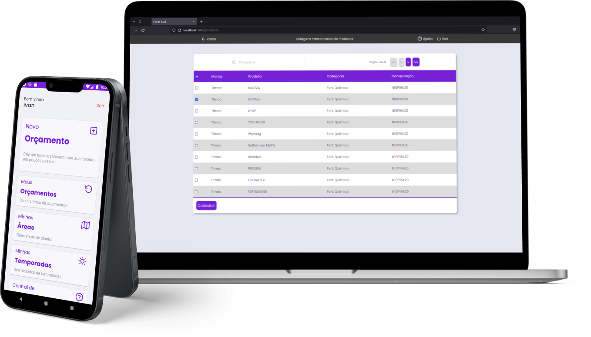

  

    
  

  <h4 align="center">Projeto final do curso superior em Sistemas de Informações.</h4>

## Resumo

  <ol>
    <li><a href="#visão-geral-do-projeto">Visão geral do projeto</a></li>
    <li><a href="#sobre-o-projeto">Sobre o projeto</a></li>
    <li><a href="#tecnologias-utilizadas">Tecnologias utilizadas</a></li>
    <li><a href="#instalação-e-utilização">Instalação e utilização</a></li>
  </ol>

## Visão geral do projeto

    

## Sobre o projeto

### Para informações detalhadas do projeto, acesse a pasta `documents`.

O Farmbud é uma aplicação que visa facilitar a fase de orçamentação de lavouras por
parte do agricultor junto aos estabelecimentos agropecuários da cidade. O responsável
do estabelecimento pode realizar o cadastro de seus produtos na plataforma web da 
aplicação, dessa forma, o catálogo de produtos ficará disponível para os agricultores
em seu dispositivo móvel. Quanto ao agricultor, o mesmo poderá indicar as suas áreas
de plantio através do aplicativo móvel. Ao realizar o cadastro das áreas, deve ser 
informado o tamanho da mesmas. O agricultor também poderá realizar os orçamentos de
suas lavouras, para isso basta selecionar uma área cadastrada anteriomente, indicar
uma temporada de plantio e por fim, selecionar um estabelecimento agropecuário de sua
preferência que ofereça produtos de qualidade e com preços atrativos. Como mencionado
anteriomente, o agricultor também poderá indicar temporadas de plantio, essa informação
é usada posteriomente para a criação de um histórico de orçamentos de lavouras, assim
o mesmo poderá visualizar seus orçamentos através dos anos.

## Tecnologias utilizadas

As principais tecnologias utilizadas na construção deste projeto foram: 

#### API

* [Node.JS](https://nodejs.org/en/)
* [Express.JS](https://expressjs.com/)
* [Date FNS](https://date-fns.org/)
* [JWT](https://jwt.io/)
* [PostgreSQL](https://www.postgresql.org/)
* [TypeORM](https://typeorm.io/)
* [UUID](https://www.uuidgenerator.net/)

#### Web

* [React.JS](https://reactjs.org/)
* [Unform](https://github.com/unform/unform)
* [Axios](https://github.com/axios/axios)
* [Polished](https://polished.js.org/)
* [React Modal](https://www.npmjs.com/package/react-modal)
* [React Router DOM](https://v5.reactrouter.com/web/guides/quick-start)
* [Styled Components](https://styled-components.com/)
* [Yup](https://www.npmjs.com/package/yup)

#### Mobile

* [Android Studio](https://developer.android.com/)
* [React Native](https://reactnative.dev/)
* [Async Storage](https://github.com/react-native-async-storage/async-storage)
* [Date Time Picker](https://github.com/react-native-datetimepicker/datetimepicker)
* [React Navigation](https://reactnavigation.org/)
* [Unform](https://github.com/unform/unform)
* [Axios](https://github.com/axios/axios)
* [Gesture Handler](https://docs.swmansion.com/react-native-gesture-handler/docs/)
* [React Native Maps](https://github.com/react-native-maps/react-native-maps)
* [Styles Components](https://styled-components.com/)
* [Yup](https://www.npmjs.com/package/yup)

## Instalação e utilização

Instruções de instalação do projeto em seu computador.

### Pré-requisitos

Instalações necessárias:

1. PostgreSQL
2. Node.JS
3. Yarn
4. Android Studio + SDK / Xcode
5. React Native CLI

### Instalação

#### API

1. Copie os dados do arquivo de DDL (`utils/SQL.sql`), para a criação do banco de dados.
2. Configure a conexão da API com o banco de dados no arquivo `ormconfig.js`.
3. Baixe as dependências com o comando `$ yarn`.
4. Inicie a API com o comando `$ yarn dev:server`.

#### Web

1. Baixe as dependências com o comando `$ yarn`.
2. Inicie o projeto Web com o comando `$ yarn start`.

#### Mobile

* [Instalação do Android Studio](https://react-native.rocketseat.dev/)

1. Baixe as dependências com o comando `$ yarn`.
2. Abra o emulador Android / IOS.
3. Inicie o React Native com o comando `$ yarn start`.
4. Para instalar o projeto e executá-lo no dispositivo móvel, execute o comando
`$ yarn run android/ios`.
5. Configure a Api de mapas no aplicativo.

* [Documentação de instalação React Native Maps](https://github.com/react-native-maps/react-native-maps/blob/master/docs/installation.md)

* [ Console da Google para configuração de chaves Google Maps SDK for Android](https://console.developers.google.com/apis/library/maps-android-backend.googleapis.com/)

 
<h4 align="center"><a href="#top">Voltar ao Início</a></h4>

"Estabilidade não existe" - Flavio Augusto
